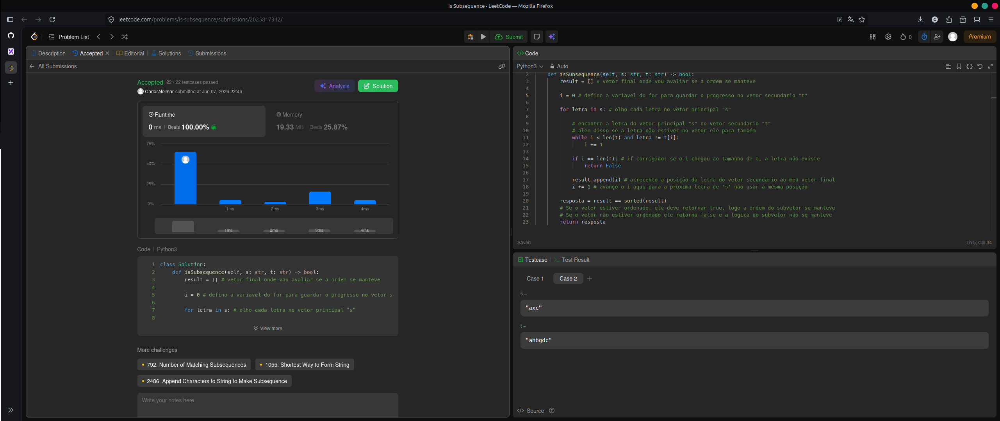

No problema Is Subsequence, temos duas strings, `s` e `t`, e precisamos verificar se é possível formar `s` usando os caracteres de `t`. Porém, existe uma limitação: as letras precisam obrigatoriamente manter a mesma ordem relativa original.

Primeiro, lidamos com a preparação inicial do nosso rastreamento. Criamos um array chamado `result`, que vai armazenar a posição (índice) onde cada letra de `s` foi encontrada dentro de `t`. Além disso, definimos uma variável `i` iniciando em zero, que servirá como um marcador do nosso progresso na string secundária `t`. É crucial que esse `i` seja iniciado antes da busca começar de fato, para garantir que não voltemos ao início da string a cada nova letra.

Em seguida, utilizamos um laço `for` para avaliar cada letra da string principal `s`, buscando-a na string `t` de forma contínua e progressiva. Para cada letra, avaliamos o caminho percorrido através dos seguintes cenários:

Procurar: utilizando um laço `while`, avançamos o nosso índice `i` pela string `t` enquanto não chegarmos ao fim dela e enquanto a letra atual de `t` for diferente da letra de `s` que estamos buscando no momento.

Não encontrar: se após a busca o nosso índice `i` atingir o tamanho total de `t` (`i == len(t)`), significa que varremos todo o restante da string secundária e a letra não está lá. Nesse caso, é impossível formar a subsequência, e retornamos `False` imediatamente.

Encontrar e salvar: se o laço `while` parar antes do fim de `t`, significa que achamos a letra correspondente. Adicionamos essa posição `i` ao nosso array `result`. Logo após, incrementamos o `i` em 1 (`i += 1`), garantindo que a busca pela próxima letra comece estritamente na posição seguinte, impedindo que a mesma letra seja usada duas vezes.

Por fim, comparamos o nosso array de posições `result` com uma versão perfeitamente ordenada dele mesmo (`sorted(result)`). Como a nossa busca no vetor `t` apenas avança e nunca retrocede, se todas as letras foram encontradas com sucesso, os índices estarão obrigatoriamente em ordem crescente. A resposta do problema é o resultado dessa comparação, que retornará `True` se a ordem foi mantida, ou `False` caso contrário.

---
# 392. Is Subsequence

Given two strings s and t, return true if s is a subsequence of t, or false otherwise.

A subsequence of a string is a new string that is formed from the original string by deleting some (can be none) of the characters without disturbing the relative positions of the remaining characters. (i.e., "ace" is a subsequence of "abcde" while "aec" is not).

 

Example 1:
```
Input: s = "abc", t = "ahbgdc"
Output: true
```
Example 2:
```
Input: s = "axc", t = "ahbgdc"
Output: false
```
 

Constraints:
```
    0 <= s.length <= 100
    0 <= t.length <= 104
    s and t consist only of lowercase English letters.
```
 
Follow up: Suppose there are lots of incoming s, say s1, s2, ..., sk where k >= 109, and you want to check one by one to see if t has its subsequence. In this scenario, how would you change your code?

---
```
class Solution:
    def isSubsequence(self, s: str, t: str) -> bool:
        result = [] # vetor final onde vou avaliar se a ordem se manteve
        
        i = 0 # defino a variavel do for para guardar o progresso no vetor secundario "t"

        for letra in s: # olho cada letra no vetor principal "s"
            
            # encontro a letra do vetor principal "s" no vetor secundario "t"
            # alem disso se a letra não estiver no vetor ele para também
            while i < len(t) and letra != t[i]: 
                i += 1 
                
            if i == len(t): # if corrigido: se o i chegou ao tamanho de t, a letra não existe
                return False
                
            result.append(i) # acrecento a posição da letra do vetor secundario ao meu vetor final
            i += 1 # avanço o i aqui para a próxima letra de 's' não usar a mesma posição
    
        resposta = result == sorted(result)
        # Se o vetor estiver ordenado, ele deve retornar true, logo a ordem do subvetor se manteve
        # Se o vetor não estiver ordenado ele retorna false e a logica do subvetor não se manteve
        return resposta
```
  
---

