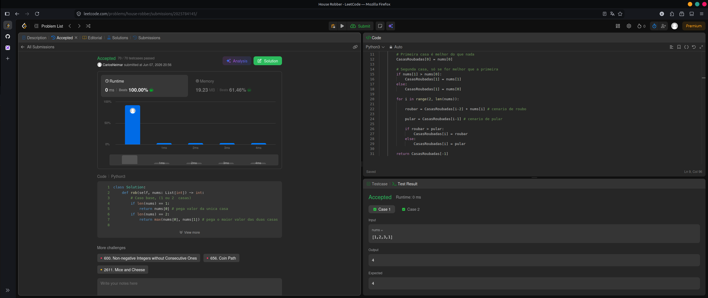

No problema House Robber, estamos em uma rua onde precisamos roubar o maior valor possível das casas. Porém, existe uma limitação: não podemos roubar casas adjacentes.

Primeiro, lidamos com os casos base, quando o número de casas no array é 1 ou 2. Se houver apenas uma casa, esse valor já é, naturalmente, o máximo possível. Se houver duas casas, a resposta é simplesmente o valor da casa mais valiosa entre as duas.

Em seguida, utilizamos programação dinâmica com uma abordagem de tabulação (guardar os resultados intermediários em um array) e bottom-up (começar resolvendo os menores subproblemas e ir avançando até o problema completo). Para isso, foi criado o array CasasRoubadas, que armazena, em cada posição, o melhor valor total que conseguimos roubar até aquela casa.

As duas primeiras posições servem como referência para iniciar a recorrência: no primeiro instante (CasasRoubadas[0]), o melhor valor é o da primeira casa. No momento seguinte (CasasRoubadas[1]), o melhor valor é o da casa mais valiosa entre as duas primeiras. A partir daí, para cada casa i, calculamos os dois cenários possíveis:

Roubar: o valor de roubar a casa atual é a soma do valor da casa nums[i] com o melhor valor possível até a casa i - 2, isto é, CasasRoubadas[i - 2] (porque não podemos roubar a casa imediatamente anterior).

Pular: o valor de pular a casa atual é simplesmente o melhor valor que já temos até a casa anterior, CasasRoubadas[i - 1].

Por fim, comparamos os dois cenários (roubar e pular) e salvamos em CasasRoubadas[i] o maior desses dois valores. Ao terminar o processamento de todas as casas, a resposta do problema é o último valor do array CasasRoubadas, que representa o maior total possível roubando casas não adjacentes.

---
# 198. House Robber

You are a professional robber planning to rob houses along a street. Each house has a certain amount of money stashed, the only constraint stopping you from robbing each of them is that adjacent houses have security systems connected and it will automatically contact the police if two adjacent houses were broken into on the same night.

Given an integer array nums representing the amount of money of each house, return the maximum amount of money you can rob tonight without alerting the police.

 

Example 1:

Input: nums = [1,2,3,1]
Output: 4
Explanation: Rob house 1 (money = 1) and then rob house 3 (money = 3).
Total amount you can rob = 1 + 3 = 4.

Example 2:

Input: nums = [2,7,9,3,1]
Output: 12
Explanation: Rob house 1 (money = 2), rob house 3 (money = 9) and rob house 5 (money = 1).
Total amount you can rob = 2 + 9 + 1 = 12.

Constraints:

    1 <= nums.length <= 100
    0 <= nums[i] <= 400

---
```
class Solution:
    def rob(self, nums: List[int]) -> int:
        # Caso base, (1 ou 2  casas)
        if len(nums) == 1:
            return nums[0] # pega valor da unica casa
        if len(nums) == 2:
            return max(nums[0], nums[1]) # pega o maior valor das duas casas disponiveis

        CasasRoubadas = [0] * len(nums) # CasasRoubadas representa o melhor valor que já possuo
        
        # Primeira casa é melhor do que nada
        CasasRoubadas[0] = nums[0]

        # Segunda casa, só se for melhor que a primeira
        if nums[1] > nums[0]:
            CasasRoubadas[1] = nums[1]
        else:
            CasasRoubadas[1] = nums[0]

        for i in range(2, len(nums)):

            roubar = CasasRoubadas[i-2] + nums[i] # cenario de roubo

            pular = CasasRoubadas[i-1] # cenario de pular

            if roubar > pular:
                CasasRoubadas[i] = roubar
            else:
                CasasRoubadas[i] = pular

        return CasasRoubadas[-1]
```
  
---

